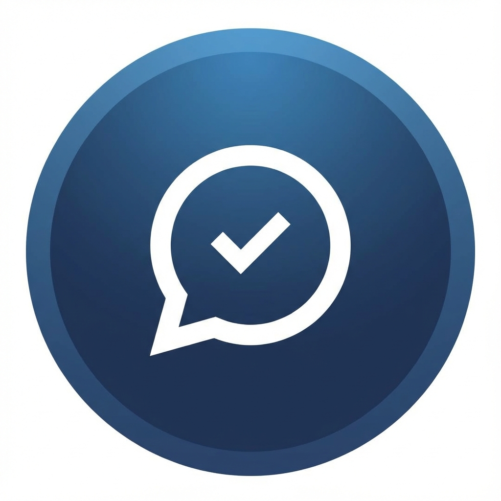

# Meet Chat Logger Pro

<p align="center">
  
</p>

<p align="center">
  <strong>Google Meet 聊天訊息即時擷取工具</strong>
</p>

<p align="center">
  <a href="#功能特色">功能特色</a> •
  <a href="#安裝方式">安裝方式</a> •
  <a href="#使用說明">使用說明</a> •
  <a href="#開發">開發</a>
</p>

---

## 功能特色

- 🎯 **即時擷取** - 使用 MutationObserver 即時監聽並擷取 Google Meet 聊天訊息
- 📝 **多種匯出格式** - 支援 Markdown 和 CSV 格式匯出
- 📋 **快速複製** - 一鍵複製所有訊息到剪貼簿
- ☁️ **雲端同步** - 支援上傳至 Google Drive
- 🎨 **現代化 UI** - 深色主題搭配漸層與玻璃擬態設計
- 💾 **自動儲存** - 訊息即時儲存，會議結束也不遺失

## 安裝方式

### 從原始碼安裝

1. **Clone 專案**
   ```bash
   git clone https://github.com/cyclone-tw/chrome-plugins.git
   cd chrome-plugins/meeting-chat-messages
   ```

2. **安裝依賴**
   ```bash
   npm install
   ```

3. **建置專案**
   ```bash
   npm run build
   ```

4. **載入至 Chrome**
   - 開啟 Chrome，前往 `chrome://extensions/`
   - 開啟右上角的「開發人員模式」
   - 點擊「載入未封裝項目」
   - 選擇專案中的 `dist` 資料夾

## 使用說明

1. 加入 Google Meet 會議
2. 點擊 Chrome 工具列上的擴充功能圖示
3. 點擊「▶ 開始監聽」按鈕
4. 會議中的聊天訊息會自動被擷取
5. 會議結束後，可選擇匯出或複製訊息

### 匯出選項

| 格式 | 說明 |
|------|------|
| Markdown | 適合存檔和閱讀 |
| CSV | 適合匯入 Excel 或 Google Sheets |
| 剪貼簿 | 快速貼上到其他應用程式 |
| Google Drive | 直接上傳到雲端 |

## 開發

### 技術棧

- **Frontend**: React 18 + TypeScript
- **Build Tool**: Vite
- **Style**: Pure CSS (Dark Theme)
- **API**: Chrome Extension Manifest V3

### 專案結構

```
src/
├── background/     # Service Worker
│   ├── index.ts    # 主邏輯 (OAuth, Download, Drive)
│   └── drive.ts    # Google Drive API
├── content/        # Content Script
│   ├── index.ts    # 入口點
│   ├── observer.ts # MutationObserver 邏輯
│   └── parser.ts   # 訊息解析器
├── popup/          # Popup UI
│   ├── App.tsx     # 主元件
│   └── styles.css  # 樣式
├── shared/         # 共用模組
│   ├── types.ts    # TypeScript 型別
│   └── constants.ts# 常數
└── utils/          # 工具函數
    ├── storage.ts  # Chrome Storage 封裝
    └── formatter.ts# 格式化工具
```

### 開發指令

```bash
# 開發模式
npm run dev

# 建置
npm run build

# 型別檢查
npm run lint
```

## 授權

MIT License

---

<p align="center">
  Made with ❤️ for better meeting productivity
</p>
